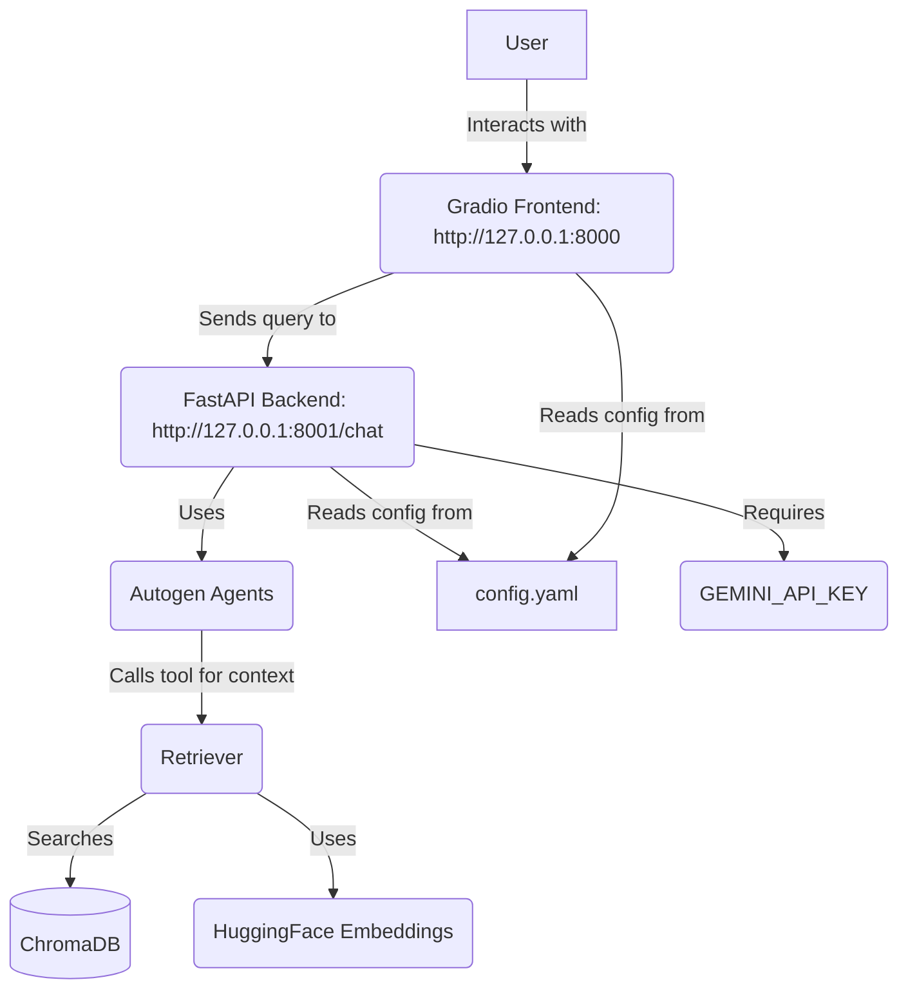

# tomo_bait
A repository for tomography Beamline AI Tools

## Architecture

```mermaid
graph TD
    User[User] -->|Interacts with| GradioFrontend(Gradio Frontend: http://127.0.0.1:8000)
    GradioFrontend -->|Sends query to| FastAPIBackend(FastAPI Backend: http://127.0.0.1:8001/chat)
    FastAPIBackend -->|Uses| AutogenAgents(Autogen Agents)
    AutogenAgents -->|Calls tool for context| Retriever(Retriever)
    Retriever -->|Searches| ChromaDB[(ChromaDB)]
    Retriever -->|Uses| HuggingFaceEmbeddings(HuggingFace Embeddings)
    FastAPIBackend -->|Reads config from| Config[config.yaml]
    GradioFrontend -->|Reads config from| Config
    FastAPIBackend -->|Requires| GeminiAPIKey(GEMINI_API_KEY)
```
