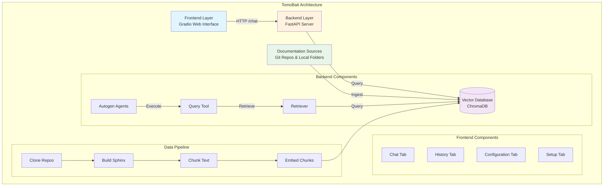
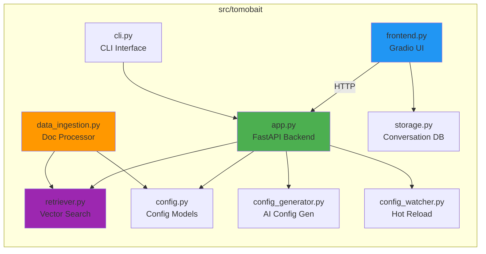
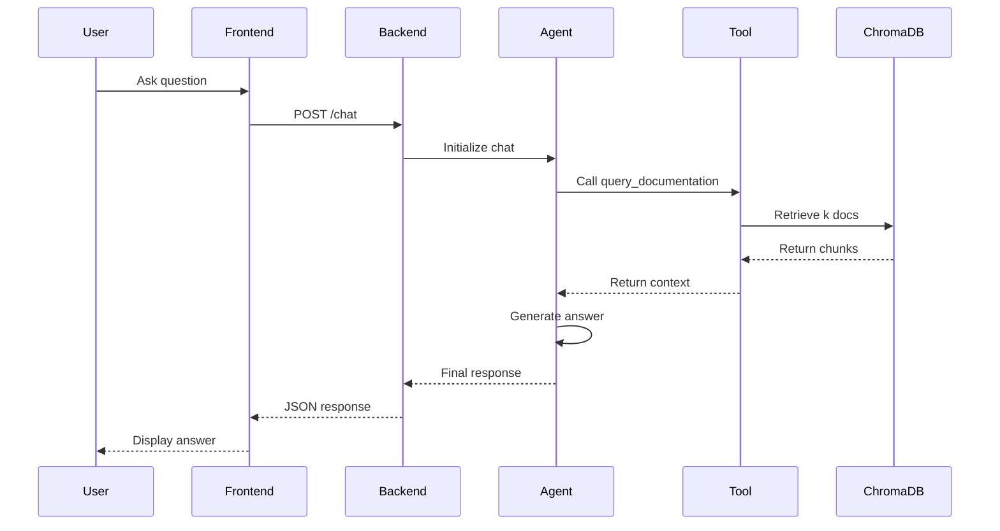

# TomoBait 🔬

A RAG (Retrieval-Augmented Generation) system for tomography beamline documentation at the Advanced Photon Source (APS). TomoBait ingests Sphinx documentation, indexes it in a vector database, and provides an AI-powered conversational interface for querying beamline documentation.

## 🌟 Features

- **Multi-Source Documentation**: Index from Git repositories and local folders
- **AI-Powered Q&A**: Ask questions in natural language and get accurate answers from documentation
- **Multiple LLM Providers**: Support for Gemini, OpenAI, Anthropic, Azure, and ANL Argo
- **Hot-Reload Configuration**: Update settings without restarting the application
- **AI Config Generator**: Generate configurations from natural language descriptions
- **Conversation History**: Save and resume conversations
- **Web Interface**: Modern Gradio-based UI with chat, history, configuration, and setup tabs

## 📦 Package Structure



## 🏗️ Module Structure



## 🚀 Quick Start

### Prerequisites

- Python 3.12
- [Pixi](https://pixi.sh/) package manager

### Installation

1. **Clone the repository**
```bash
git clone <repository-url>
cd tomo-bait
```

2. **Install dependencies**
```bash
pixi install
pixi run install
```

3. **Set up environment variables**
```bash
cp .env.example .env
# Edit .env and add your API key (GEMINI_API_KEY, OPENAI_API_KEY, etc.)
```

4. **Ingest documentation** (first time only)
```bash
pixi run ingest
```

5. **Start the application**
```bash
# Terminal 1: Start backend
pixi run start-backend

# Terminal 2: Start frontend
pixi run start-frontend
```

6. **Access the UI**

Open your browser to `http://localhost:8000`

## 🔧 Configuration

TomoBait uses a centralized `config.yaml` configuration file with hot-reload support.

### Configuration Sections

```yaml
project:
  name:                  # Project identifier (used in directory naming)
  data_dir:              # Base directory for all project data (e.g., .bait-tomo)

storage:
  conversations_dir:     # Directory for conversation storage (defaults to {data_dir}/conversations)

documentation:
  git_repos:             # List of Git repository URLs
  local_folders:         # List of local folder paths
  docs_output_dir:       # Where to store documentation (defaults to {data_dir}/documentation)
  sphinx_build_html_path: # Path to built Sphinx HTML (auto-detected if null)
  resources:             # Reference resources (beamlines, software, organizations, etc.)

retriever:
  db_path:               # ChromaDB storage path (defaults to {data_dir}/chroma_db)
  embedding_model:       # HuggingFace model name
  k:                     # Number of documents to retrieve
  search_type:           # similarity, mmr, or similarity_score_threshold

llm:
  api_key_env:          # Environment variable name for API key
  model:                # Model name (gemini-2.5-flash, gpt-4, etc.)
  api_type:             # google, openai, azure, anthropic
  system_message:       # System prompt for the agent

text_processing:
  chunk_size:           # Text chunk size (100-5000)
  chunk_overlap:        # Overlap between chunks (0-1000)

server:
  backend_host:         # Backend server host
  backend_port:         # Backend server port
  frontend_host:        # Frontend server host
  frontend_port:        # Frontend server port
```

### Switching LLM Providers

You can switch between LLM providers in the Configuration tab or by editing `config.yaml`:

**Gemini (Default)**
```yaml
llm:
  api_key_env: GEMINI_API_KEY
  model: gemini-2.5-flash
  api_type: google
```

**OpenAI**
```yaml
llm:
  api_key_env: OPENAI_API_KEY
  model: gpt-4
  api_type: openai
```

**Anthropic (Claude)**
```yaml
llm:
  api_key_env: ANTHROPIC_API_KEY
  model: claude-3-opus
  api_type: anthropic
```

**ANL Argo** (Internal LLM service)
```yaml
llm:
  api_type: anl_argo
  anl_api_url: https://your-anl-argo-endpoint/api/llm
  anl_user: your_anl_username
  anl_model: llama-2-70b
```

## 📋 Available Commands

```bash
# Development
pixi run start-backend   # Start FastAPI backend (port 8001)
pixi run start-frontend  # Start Gradio frontend (port 8000)
pixi run run-cli "query" # Run CLI interface

# Data Management
pixi run ingest         # Ingest documentation into vector DB

# Code Quality
pixi run lint           # Check code style
pixi run format         # Format code with ruff
```

## 🏛️ System Architecture

### Three-Layer Design



### 1. Data Ingestion Layer

- Clones Git repositories or reads local folders
- Builds Sphinx documentation to HTML
- Chunks documents using `RecursiveCharacterTextSplitter`
- Embeds chunks using HuggingFace `sentence-transformers/all-MiniLM-L6-v2`
- Stores in ChromaDB vector database

### 2. Backend/Agent Layer

- FastAPI server with REST API
- Two-agent system using Autogen (AG2):
  - `doc_expert`: LLM-powered agent that answers questions
  - `tool_worker`: Executes the `query_documentation` tool
- Agent workflow:
  1. User question → doc_expert
  2. doc_expert calls query_documentation tool
  3. tool_worker retrieves relevant docs from ChromaDB
  4. doc_expert synthesizes answer from context

### 3. Frontend Layer

- Gradio-based web interface
- Four tabs:
  - **Chat**: Conversational interface
  - **History**: View and resume past conversations
  - **Configuration**: Edit all settings with hot-reload
  - **Setup**: AI-powered config generation
- Auto-save conversations
- Image rendering from documentation

## 🔬 Tomography Resources

TomoBait is configured with comprehensive resources for APS tomography beamlines:

- **Beamlines**: 2-BM, 32-ID (TXM)
- **Reconstruction Tools**: TomoPy, ASTRA Toolbox, scikit-image
- **Beamline Control**: tomoscan, dmagic, pyEPICS
- **Data Processing**: tomopy-cli, Xi-CAM, dxfile
- **Visualization**: Tomviz, napari, ParaView
- **File Formats**: h5py, nexusformat, tifffile

See `config.yaml` for the complete list with links.

## 🤝 Contributing

### Code Style

- Ruff for linting and formatting
- Line length: 88 characters
- Double quotes, space indentation

### Development Workflow

1. Make changes
2. Run `pixi run format` to format code
3. Run `pixi run lint` to check style
4. Test changes locally
5. Commit and push

## 📄 License

[Add your license here]

## 🙏 Acknowledgments

- Advanced Photon Source (APS) at Argonne National Laboratory
- 2-BM and 32-ID beamline teams
- TomoPy and related open-source projects

## 📚 Documentation

For detailed development guidance, see [CLAUDE.md](CLAUDE.md).

## 🐛 Troubleshooting

### Backend won't start
- Check that `GEMINI_API_KEY` (or your chosen provider's key) is set in `.env`
- Verify ChromaDB exists: run `pixi run ingest` if needed

### Frontend can't connect
- Ensure backend is running on port 8001
- Check firewall settings

### No documents retrieved
- Verify project data directory exists (e.g., `.bait-tomo/`)
- Check ChromaDB path in config.yaml (defaults to `.bait-tomo/chroma_db`)
- Re-run ingestion: `pixi run ingest`
- Check that embedding model matches between ingestion and retrieval

## 📞 Support

For issues and questions, please open an issue on GitHub.
